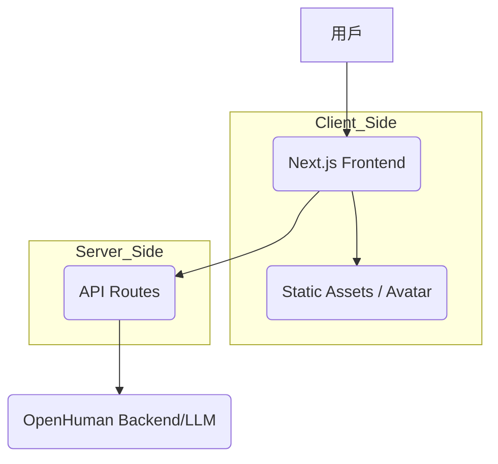

# Tiny Project 🚀

這是基於 [OpenHuman](https://github.com/tinyhumansai/OpenHuman) 靈感所建立的專案，旨在開發一個與「Tiny Humans」互動的現代化網站。

## 1. 專案願景
建立一個直觀、可愛且具互動性的界面，讓用戶可以與其數字化身（Tiny Humans）進行交流、管理和展示。

## 2. 核心特色 (依據 OpenHuman & Token 連結)
- **數字化身展示**：以 2D/3D 形式展示如黃色小精靈般的角色。
- **代幣整合 (Web3)**：
    - 連結 Solana 代幣：`2AF7CqwieUjUPALL7icuZtL3X7wENdjUjGBMmfV2pump`
    - 顯示即時價格、市值與交易量。
    - 整合 「Buy Now」按鈕連結至 Pump.fun 或 Raydium。
- **即時互動**：透過對話框或動作與 AI 代理互動。

## 3. 建議技術棧
- **Frontend**: [Next.js](https://nextjs.org/) (App Router)
- **Web3**: [@solana/web3.js](https://solana-labs.github.io/solana-web3.js/), [@solana/wallet-adapter-react](https://github.com/solana-labs/wallet-adapter)
- **Data API**: [DexScreener API](https://dexscreener.com/developer/embed) 或 [Birdeye API](https://docs.birdeye.so/)
- **Styling**: [Tailwind CSS](https://tailwindcss.com/)
- **Animations**: [Framer Motion](https://www.framer.com/motion/)

## 4. 目錄結構建議
```text
tiny/
├── src/
│   ├── components/      # UI 組件 (Avatar, Chat, Sidebar)
│   ├── app/             # Next.js 頁面路由
│   ├── hooks/           # 自定義邏輯
│   ├── lib/             # API 客戶端與工具
│   └── assets/          # 圖片與模型 (如黃色精靈素材)
├── public/              # 靜態資源
└── package.json
```

## 5. 開發步驟
1. [x] 初始化 Next.js 專案架構與 Web3 環境
2. [x] 設計基礎 UI 佈局（以海灘風格結合代幣資訊面板）
3. [x] 串接 Solana 鏈上數據，顯示代幣資訊
4. [x] 整合 OpenHuman 相關 AI 邏輯與角色動畫

## 6. 系統架構 (Mermaid)



## 7. Premium Requirements (Added 2026-05-13)
- [x] High-end professional UI (Glassmorphism, refined typography)
- [x] Website language: English only
- [x] Core Visual: Tiny Human character focus
- [x] Social integration: GitHub, X Community, Telegram, Meme Channel
- [x] Infinite Scroll Meme Gallery
